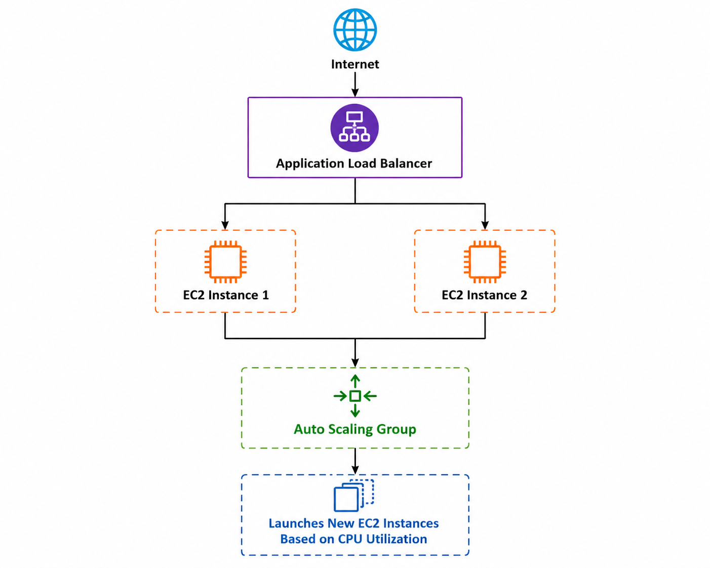

# AWS Elastic Load Balancer (ELB) with Auto Scaling

## Project Overview

This project demonstrates the implementation process of an AWS Application Load Balancer (ELB) integrated with an Auto Scaling Group. The objective is to distribute incoming traffic across multiple EC2 instances while automatically scaling the infrastructure based on CPU utilization.

> **Note:** This repository is documentation-based because an active AWS subscription was not available. It explains the complete implementation process and architecture.

---

## Deliverables

- Configured Elastic Load Balancer (Documentation)
- Auto Scaling Group with Scaling Policies
- Complete Setup Documentation

---

## AWS Services Used

- Amazon EC2
- Application Load Balancer (ALB)
- Auto Scaling Group
- Launch Template
- Amazon Machine Image (AMI)
- CloudWatch

---

## Architecture



---

## Repository Contents

| File | Description |
|------|-------------|
| implementation-guide.md | Complete setup process |
| configured-elb.md | ELB configuration |
| auto-scaling-group.md | Auto Scaling Group setup |
| scaling-policy.md | CPU based scaling policy |
## 📂 Repository Structure

```text
AWS-ELB-AutoScaling/
│
├── README.md                   # Project overview and documentation
├── implementation-guide.md     # Step-by-step implementation guide
├── configured-elb.md           # Elastic Load Balancer configuration
├── auto-scaling-group.md       # Auto Scaling Group configuration
├── scaling-policy.md           # CPU-based scaling policy
├── architecture.png            # AWS architecture diagram
└── LICENSE                     # MIT License
```

### 📄 File Descriptions
```text
| File                        | Description                                                                                                |
| --------------------------- | ---------------------------------------------------------------------------------------------------------- |
| **README.md**               | Main documentation containing project overview, architecture, objectives, and setup details.               |
| **implementation-guide.md** | Complete step-by-step guide for implementing ELB and Auto Scaling on AWS.                                  |
| **configured-elb.md**       | Documentation explaining the configuration of the Application Load Balancer.                               |
| **auto-scaling-group.md**   | Details about the Auto Scaling Group, capacity settings, and launch template.                              |
| **scaling-policy.md**       | Explains the Target Tracking Scaling Policy based on CPU utilization.                                      |
| **architecture.png**        | Architecture diagram showing the interaction between Internet, ELB, EC2 instances, and Auto Scaling Group. |
| **LICENSE**                 | MIT License for the project.                                                                               |

```


---

## Learning Outcomes

- Elastic Load Balancer
- EC2
- Auto Scaling
- Launch Templates
- CloudWatch Monitoring
- High Availability
- Scalability

---

## Author

**Adnan Akhtar**
GitHub: https://github.com/AdnanAK8
